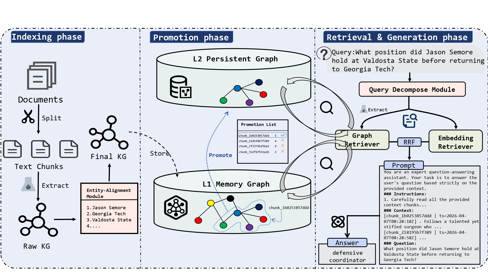

# CacheGraphRAG

<p align="center">
  <a href="https://www.python.org/"></a>
  <a href="https://www.docker.com/"></a>
  <a href="https://milvus.io/"></a>
  <a href="https://www.nebula-graph.io/"></a>
  
</p>

> **English** · [中文](./README_zh.md)

CacheGraphRAG is a **self-purifying** Graph-based Retrieval-Augmented Generation (RAG) framework designed for **continuous streaming knowledge ingestion**. It is built on an **L1/L2 two-tier graph cache** for efficient graph indexing and retrieval: L1 uses NetworkX as an in-memory hot cache (LRU+TTL eviction), while L2 uses NebulaGraph as the persistent store. An access-frequency-driven hot/cold promotion mechanism (Knowledge Purification) filters extraction noise at promotion time and suppresses unbounded graph inflation.

---

## 📖 Background and Motivation

Integrating Knowledge Graphs with Retrieval-Augmented Generation (RAG) significantly enhances the complex reasoning capabilities of Large Language Models (LLMs). However, in real-world deployments characterized by **high-frequency streaming document ingestion** and **complex multi-hop question answering**, existing Graph-based RAG systems expose three fundamental bottlenecks:

1. **Prohibitive graph-indexing and entity-alignment overhead**: Mainstream systems rely on synchronous LLM calls during triplet extraction and global entity disambiguation. The near O(N²) call complexity causes severe update latency and cost under continuous data streams.
2. **Graph topology pollution and unbounded inflation**: Conventional systems adopt an "eager write" strategy, committing every extracted entity and relation directly to a persistent graph database. As streaming documents keep arriving, the graph densifies rapidly, triggering neighborhood explosions around high-degree super nodes during retrieval and injecting extensive long-tail noise.
3. **Semantic drift via passive one-shot retrieval**: Static retrieval pipelines cannot adaptively adjust search intent based on accumulated intermediate clues. When encountering relational gaps in the topology, they easily drift into irrelevant branches, breaking multi-hop reasoning chains.

CacheGraphRAG resolves these bottlenecks through three synergistic mechanisms:

1. **Asynchronous pipelined indexing engine**: Decouples high-latency LLM symbolic extraction from embedding generation, combined with an **LLM-free funnel-based entity alignment** (cascading similarity thresholds + alias constraints) that stitches graph fragments at minimal overhead for low-latency graph construction.
2. **Continuous dual-layer graph cache architecture**: The L1 memory graph is bounded by hard capacity limits (LRU+TTL + reference-counting garbage collection); L2 only solidifies high-value subgraphs passing the access-frequency threshold `h(c) >= tau_hit` (knowledge purification), backed by a full-scale vector store. **Lazy Topology Rehydration** restores long-tail connectivity within milliseconds on cache misses—without any LLM calls.
3. **Iterative agentic query decomposer**: Instantiates the LLM as an active planning agent that performs Beam Search over the graph topology with hop-decay constraints (γ^l), dynamically planning next-hop exploration paths based on intermediate states and suppressing exponential noise propagation from multi-branch topological divergence.

**Key results**: On RGB, 2WikiMultihopQA, HotpotQA, and the self-constructed streaming benchmark SpecificQA, CacheGraphRAG achieves leading end-to-end QA accuracy; it significantly reduces streaming indexing latency and compresses the persistent topological footprint (node/edge counts) by **81.1%–94.7%** compared to the most space-efficient baselines.

---

## 🏗️ Core Architecture



## 📁 Project Structure

```
CacheGraphRAG/
├── src/
│   ├── CacheGraphRAG.py           # Main entry + CLI
│   ├── pipeline.py                # Document ingestion pipeline (asyncio.gather for Lazy Batched Embedding)
│   ├── memory_graph.py            # L1 memory graph (L1CachePolicy: LRU+TTL) + L2 NebulaGraph
│   │                                 # rehydrate_chunk_from_milvus() for Lazy Rehydration
│   ├── retriever.py               # HybridRetriever (configurable gamma/B/max_hops)
│   ├── IterativeAgenticEngine.py  # IterativeAgenticEngine (code-level loop-breaking)
│   ├── retrieval/
│   │   ├── fusion.py              # RRF / Weighted / Dual fusion (k parameter)
│   │   └── reranker.py            # API / Local reranker
│   ├── entity/
│   │   ├── resolver.py            # AsyncEntityResolver (Funnel Alignment: tau_sim, tau_desc)
│   │   └── bert_sim.py            # BERTScore (all-MiniLM-L6-v2)
│   ├── llm/
│   │   └── env.py                 # LLM + Embedding environment (OpenAI/DeepSeek/Ollama)
│   ├── eval.py                    # Evaluation metrics (EM, ROUGE-L, BERTScore)
│   └── utils/
│       ├── prompts.py             # Prompt templates
│       ├── logger.py              # Pipeline logger
│       ├── llm_cache.py           # LLM response cache
│       └── base.py                # Base utilities (config, JSON, checkanswer)
├── database/
│   ├── milvus.py                  # Milvus vector DB wrapper
│   ├── nebulagraph.py             # NebulaGraph client wrapper
│   └── setup/                     # Docker install scripts
├── data/                          # Dataset loaders + datasets
├── config/
│   └── config.yaml                # Global configuration
├── scripts/
│   ├── storage_analysis.py        # Storage footprint analysis (Table V / bottleneck verification)
│   ├── efficiency_comparison.py   # Efficiency comparison (latency + token cost + LLM calls)
│   └── fair_evaluation.py         # Fig. 5 fair evaluation reproduction (from empty L1+L2)
├── requirements.txt
└── README.md
```

## ⚙️ Setup and Deployment

### Prerequisites

- Python >= 3.10
- Docker (Milvus + NebulaGraph)

### Installation

```bash
git clone https://github.com/your-username/CacheGraphRAG.git
cd CacheGraphRAG

conda create -n cachegraphrag python=3.10 -y
conda activate cachegraphrag

pip install -r requirements.txt
```

### Database Configuration

This project uses [Milvus](https://github.com/milvus-io/milvus) as the vector database (storing chunk / entity vectors and serving as the rehydration fallback substrate) and [NebulaGraph](https://github.com/vesoft-inc/nebula) as the graph database (the L2 persistent storage layer).

Both databases are deployed via Docker. The setup scripts are located under `database/setup/` and require no sudo (the current user must be able to run `docker` and `docker compose` directly). Use the following commands to install and start them:

```bash
# Install and start Milvus (standalone, image milvusdb/milvus:v2.3.9, data stored under ~/.local/share/milvus)
bash database/setup/milvus-install-user.sh start

# Install and start NebulaGraph (docker-compose deployment, including NebulaGraph Studio and console)
bash database/setup/nebula-install-user.sh install
```

#### Service Management

```bash
# Milvus: stop to shut down / delete to remove the container and data
bash database/setup/milvus-install-user.sh stop|delete

# NebulaGraph: start / stop / delete (default working directory ~/.nebula-up)
bash database/setup/nebula-install-user.sh start|stop|delete

# Restart NebulaGraph (pass the compose working directory)
bash database/setup/nebula-restart-user.sh ~/.nebula-up
```

#### Connectivity Check

The framework automatically checks connectivity to both databases on startup (and exits with the setup commands printed above on failure). You can also verify the container status manually:

```bash
docker ps | grep -E "milvus|nebula"
```

---

## 🚀 Quick Start

### Python API (Index + Retrieve + Answer)

```python
import asyncio
from src.CacheGraphRAG import CacheGraphRAG

app = CacheGraphRAG(
    dataset="hotpotqa",
    l1_max_chunks=100,       # C_max
    promotion_threshold=3,   # tau_hit
)

async def main():
    await app.index(start=0, end=300)
    app.load_dataset(start=0, end=300)
    results = await app.query(
        questions=app.questions[:5],
        start=0, end=5,
        mode="hybrid",
        answer_topk=6,
    )
    for r in results:
        print(f"Q: {r['query']}\nA: {r['predict']}\n")
    app.shutdown()

asyncio.run(main())
```

### Command Line

Set all options in `config/config.yaml` and run:

```bash
# Full pipeline (index + QA)
python -m src.CacheGraphRAG

# Index only (config.yaml: retrieval.index_only = true)
python -m src.CacheGraphRAG

# QA only, skip indexing (config.yaml: retrieval.skip_index = true)
python -m src.CacheGraphRAG
```

---

## 🔬 Reproducing Paper Experiments

### Datasets

The paper uses four datasets (three public benchmarks + one self-built benchmark):

| Dataset | Type | Questions | Passages | Tokens |
|---------|------|-----------|----------|--------|
| RGB | Noise-robust reasoning | 300 | 7,976 | 1,649,548 |
| 2WikiMultihopQA | Multi-hop reasoning | 600 | 6,000 | 536,444 |
| HotpotQA | Multi-hop reasoning | 600 | 5,949 | 796,386 |
| SpecificQA | Same-name entity disambiguation | 600 | 2,066 | 436,552 |

Notes:

- **RGB**: Contains single-hop and multi-hop queries over noisy documents, used to test robustness against noise.
- **2WikiMultihopQA / HotpotQA**: Standard multi-hop QA benchmarks requiring cross-document entity linking and multi-hop aggregation; following prior work, 600 queries are randomly selected from each.
- **SpecificQA**: Built on WhoQA via feature-constrained question restructuring, artificially injecting adversarial entity chunks that share identical names but distinct descriptions into the document stream. It is exclusively used to stress-test disambiguation capability and incremental update cost; each sample contains `phase_1_data` (distractor entity documents) and `phase_2_data` (target entity documents) as two-phase streaming inputs.

### Experimental Settings

All hyperparameters are defined in `config/config.yaml`. Paper notation → config key mapping:

| Paper Symbol | Config Key | Default | Description |
|--------------|------------|---------|-------------|
| `tau_sim` | `entity_alignment.tau_sim` | 0.85 | Entity vector similarity threshold |
| `tau_desc` | `entity_alignment.tau_desc` | 0.5 | Entity description similarity threshold |
| `tau_hit` | `indexing.tau_hit` | 3 | Chunk promotion threshold h(c) >= tau_hit |
| `C_max` | `indexing.C_max` | 100 | L1 cache capacity limit (max chunks) |
| `gamma` | `retrieval.gamma` | 0.5 | Hop-decay weight (gamma^l) |
| `B` | `retrieval.B` | 5 | Beam width (top-B nodes per hop) |
| `k` | `fusion.k` | 60 | RRF fusion parameter |

### End-to-End QA Accuracy

For each dataset, edit `config/config.yaml`, run the full pipeline, then compute ACC / ROUGE-L / BERTScore with the evaluation script:

```yaml
# config/config.yaml — HotpotQA example
data:
  dataset: hotpotqa        # rgb_en_refine | wikimultihopqa | hotpotqa
  start: 0
  end: 600                 # 300 for RGB; 600 for 2Wiki / HotpotQA

retrieval:
  nebula_space: hotpotqa   # keep consistent with dataset
  chunk_collection: hotpotqa
  entity_index_name: entity_index_hotpotqa
  index_only: false
  skip_index: false
```

```bash
# 1. Run the full pipeline (document indexing + retrieval + answering)
python -m src.CacheGraphRAG
# QA results are saved to output/qa/qa_results_hotpotqa_0_600.json

# 2. Compute ACC / ROUGE-L / BERTScore
python -c "from src.eval import evaluate_from_file, print_report; print_report(evaluate_from_file('output/qa/qa_results_hotpotqa_0_600.json', use_rougel=True, use_bert=True))"
```

The `dataset` values for the three benchmarks are: RGB → `rgb_en_refine`, 2Wiki → `wikimultihopqa`, HotpotQA → `hotpotqa`. When switching datasets, update `nebula_space` / `chunk_collection` / `entity_index_name` accordingly.

The remaining experiments can be found in the scripts under `scripts/`.

---

## 📊 Experimental Results

The following tables report part of the experimental results from the paper (see the paper for details).

### Table III: End-to-End QA Performance

| Method | RGB ACC | RGB R-L | RGB BERT | 2Wiki ACC | 2Wiki R-L | 2Wiki BERT | HotpotQA ACC | HotpotQA R-L | HotpotQA BERT |
|--------|---------|---------|----------|-----------|-----------|------------|--------------|--------------|---------------|
| MS-GraphRAG | 94.67 | 0.924 | 0.735 | 36.20 | 0.392 | 0.435 | 42.70 | 0.516 | 0.496 |
| LightRAG | 64.70 | 0.647 | 0.571 | 30.00 | 0.345 | 0.434 | 29.30 | 0.417 | 0.572 |
| HippoRAG | 91.00 | 0.875 | 0.806 | 66.30 | 0.688 | 0.687 | 57.50 | 0.645 | 0.695 |
| HippoRAG2 | **98.70** | 0.732 | 0.846 | 61.80 | 0.645 | 0.702 | 62.70 | 0.705 | 0.764 |
| EraRAG | 73.33 | 0.766 | 0.429 | 49.00 | 0.518 | 0.472 | 36.30 | 0.422 | 0.463 |
| KAG | 97.30 | 0.724 | 0.829 | 70.70 | 0.723 | 0.767 | 68.00 | 0.749 | 0.782 |
| HyperGraphRAG | 97.67 | 0.942 | 0.583 | 39.80 | 0.405 | 0.409 | 51.70 | 0.547 | 0.522 |
| Clue-RAG | 97.67 | 0.940 | 0.853 | 55.50 | 0.508 | 0.643 | 63.17 | 0.611 | 0.729 |
| **CacheGraphRAG** | 97.67 | **0.948** | **0.860** | **73.17** | **0.753** | **0.780** | **68.30** | **0.760** | **0.800** |

### Table IV: Indexing Time (seconds)

| Method | RGB | 2Wiki | HotpotQA | SpecificQA (Index) | SpecificQA (Update) |
|--------|------|-------|----------|--------------------|---------------------|
| MS-GraphRAG | 25693.87 | 4811.89 | 4291.40 | 5603.09 | 5487.59 |
| LightRAG | 7171.88 | 2497.70 | 4127.51 | 4052.27 | 2122.83 |
| HippoRAG2 | 6315.58 | 2500.48 | 4690.68 | 1864.41 | 896.83 |
| KAG | 6955.52 | 3077.61 | 3009.99 | 3290.18 | 1073.76 |
| HyperGraphRAG | 20356.20 | 5625.48 | 7046.84 | 3087.18 | 1024.46 |
| **CacheGraphRAG** | **4560.60** | **2204.72** | **2907.40** | **1363.60** | **579.80** |

### Table V: Persistent Topological Footprint (Node / Edge Counts)

CacheGraphRAG\* denotes the ablation variant with the dual-layer cache architecture removed.

| Method | RGB Node | RGB Edge | 2Wiki Node | 2Wiki Edge | HotpotQA Node | HotpotQA Edge |
|--------|----------|----------|------------|------------|---------------|---------------|
| MS-GraphRAG | 22,877 | 34,211 | 12,899 | 11,980 | 8,688 | 7,384 |
| LightRAG | 20,257 | 18,432 | 12,060 | 7,304 | 19,519 | 12,620 |
| HippoRAG | 42,717 | 203,743 | 18,896 | 74,708 | 33,384 | 102,376 |
| HippoRAG2 | 49,095 | 260,440 | 22,203 | 91,717 | 38,868 | 42,928 |
| KAG | 109,820 | 155,554 | 37,007 | 53,093 | 53,369 | 85,684 |
| HyperGraphRAG | 126,360 | 114,151 | 64,787 | 52,167 | 81,581 | 67,240 |
| Clue-RAG | 35,734 | 48,257 | 63,129 | 89,615 | 110,640 | 140,305 |
| CacheGraphRAG\* | 32,948 | 52,298 | 19,299 | 18,672 | 34,190 | 35,765 |
| **CacheGraphRAG** | **1,059** | **1,257** | **1,081** | **1,035** | **1,391** | **1,393** |

### SpecificQA: Entity Disambiguation Performance

| Method | ACC | Rouge-L | BERTScore |
|--------|------|---------|-----------|
| MS-GraphRAG | 57.83 | 0.413 | 0.568 |
| LightRAG | 25.00 | 0.335 | 0.488 |
| HippoRAG2 | 81.20 | 0.826 | **0.841** |
| EraRAG | 55.00 | 0.558 | 0.592 |
| KAG | 64.33 | 0.257 | 0.588 |
| HyperGraphRAG | 68.00 | 0.697 | 0.577 |
| **CacheGraphRAG** | **83.00** | **0.833** | 0.825 |

---

## 🤝 Contributing

We warmly welcome community contributions! You can participate in improving CacheGraphRAG in the following ways.

### Reporting Issues and Suggestions

- Use [Issues](https://github.com/your-username/CacheGraphRAG/issues) to report bugs, propose new features, or suggest improvements.
- When submitting an issue, please provide the environment (Python / Docker versions), reproduction steps, expected vs. actual behavior, and relevant log snippets to help us locate the problem faster.

### Submitting Code

1. **Fork** this repository and create a feature branch:

   ```bash
   git checkout -b feature/your-feature-name
   ```

2. Keep your code consistent with the existing style (PEP 8) and ensure your changes pass a minimal verification:

   ```bash
   python -m src.CacheGraphRAG
   ```

3. When submitting a Pull Request, clearly describe the motivation, implementation, and verification results, and link related issues.
